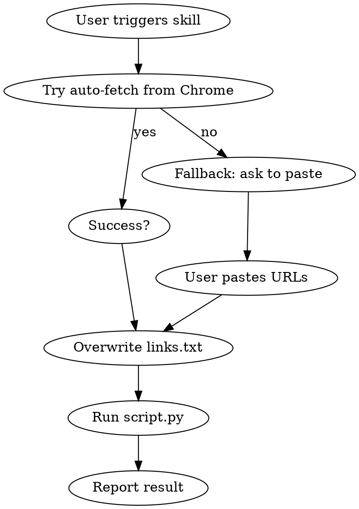

# Create Coloring Book

Generate a print-ready A4 coloring book (DOCX) from image URLs.

## Workflow



1. **Attempt automatic URL fetch** from Chrome using `get_chrome_urls.py` (Chrome DevTools Protocol). This script tries to activate Chrome and retrieve URLs from all open page tabs. It requires Chrome to be running with `--remote-debugging-port=9222`.
2. If automatic fetch **succeeds** (non-empty output), **overwrite** `links.txt` in the project root (`/home/gil/projects/coloring-book/links.txt`) with those URLs, one per line.
3. If automatic fetch **fails** or returns no URLs, **ask the user** to paste the image URLs manually (one per line). Do NOT proceed until URLs are provided. Then overwrite `links.txt`.
4. **Activate the virtualenv** and **run the script**:
   ```bash
   source /home/gil/projects/coloring-book/venv/bin/activate && python /home/gil/projects/coloring-book/script.py
   ```
5. **Report the result** — confirm success and the output filename, or relay any errors.

## Chrome Automation Notes

- The `get_chrome_urls.py` script uses the Chrome DevTools Protocol. Ensure Chrome is launched with the `--remote-debugging-port=9222` flag.
- The script attempts to activate the Chrome window (bring to foreground) before fetching tabs. On multi-window setups, it may return tabs from all windows.
- If you have multiple Chrome windows and only want one, close extra windows or use manual paste.

## Important

- Always overwrite `links.txt` completely. Never append to it.
- Clean each URL: strip whitespace and trailing commas before writing.
- The output file is `Kawaii_Coloring_Book_Final.docx` in the project directory.
