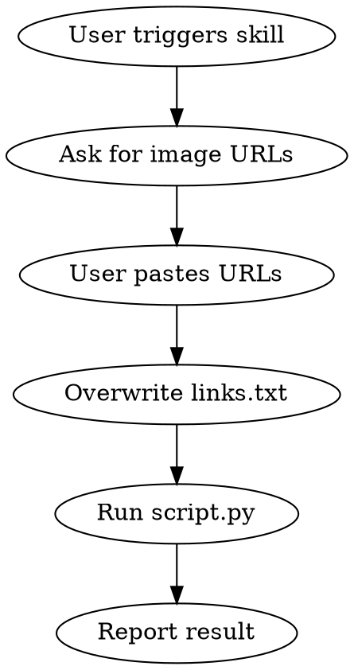

# Create Coloring Book

Generate a print-ready A4 coloring book (DOCX) from a list of image URLs.

## Workflow



1. **Ask the user** to paste the image URLs (one per line). Do NOT proceed until URLs are provided.
2. **Overwrite** `links.txt` in the project root (`/home/gil/projects/coloring-book/links.txt`) with exactly the URLs the user provided — one per line, no trailing commas, no blank lines. Previous contents are always replaced.
3. **Activate the venv** and **run the script**:
   ```bash
   source /home/gil/projects/coloring-book/venv/bin/activate && python /home/gil/projects/coloring-book/script.py
   ```
4. **Report the result** — confirm success and the output filename, or relay any errors.

## Important

- Always overwrite `links.txt` completely. Never append to it.
- Clean each URL: strip whitespace and trailing commas before writing.
- The output file is `Kawaii_Coloring_Book_Final.docx` in the project directory.
